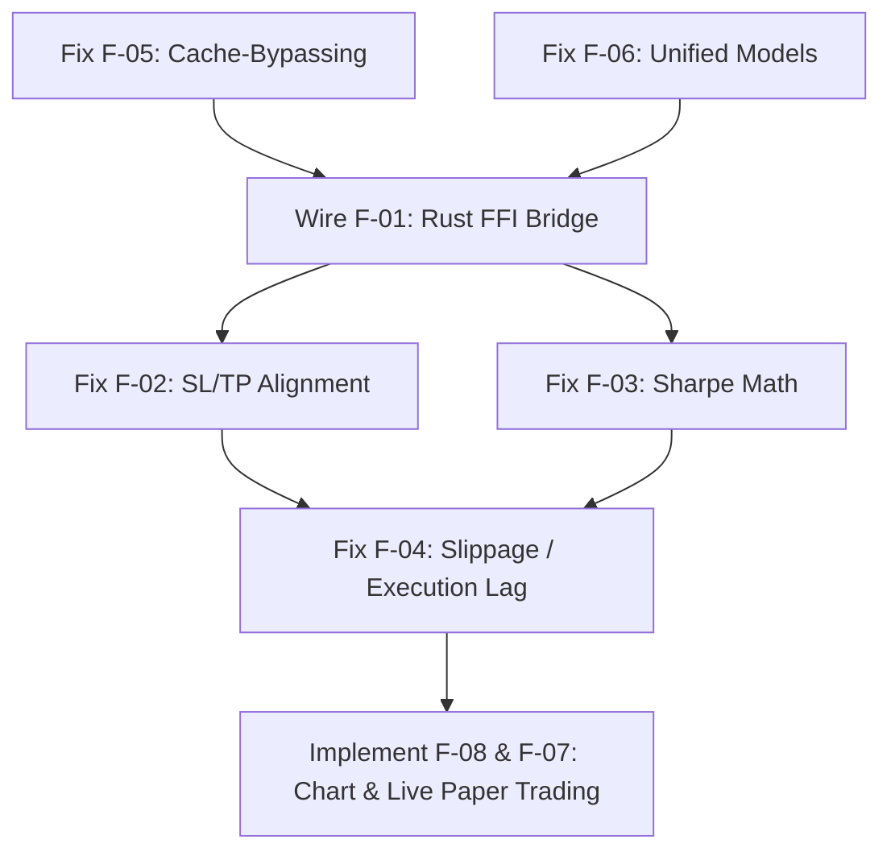

# QA Audit – OrderPilot Portabel Prototyp

**Datum:** 22. Mai 2026  
**Projekt:** OrderPilot Portabel (Flutter & Rust Trading Engine)  
**Dokument-ID:** `260522_0246_QA_AUDIT_REPORT`

---

## 1. Executive Summary

Der OrderPilot Portabel Prototyp demonstriert eine moderne Benutzeroberfläche zur Visualisierung von Backtests auf Basis historischer Binance-Daten. Die angestrebte Core-Architektur (eine performante, in Rust implementierte Handels-Engine) ist jedoch im aktuellen Zustand **vollständig unverdrahtet und durch eine redundante Dart-Nachbildung simuliert**. Darüber hinaus weisen die Backtest-Berechnungen in Dart gravierende mathematische Mängel (Sharpe-Ratio-Formel, Look-Ahead Bias) auf, und kritische Risikomanagement-Parameter wie Stop-Loss (SL) und Take-Profit (TP) fehlen gänzlich. Folglich sind die im aktuellen Frontend erzeugten Optimierungsergebnisse **nicht als belastbare Parameter für das Paper- oder Live-Trading geeignet**.

---

## 2. Findings-Matrix

| ID | Severity | Kategorie | Titel | Datei & Referenz | Zuständigkeit |
|---|---|---|---|---|---|
| **F-01** | `CRITICAL` | Architektur / FFI | Rust-Engine vollständig unverdrahtet | [rust_bridge.dart](file:///d:/03_Git/02_Python/07_Orderpilot_Portabel2/lib/services/rust_bridge.dart#L161-L281) | Backend-Engineer |
| **F-02** | `CRITICAL` | Business-Logik | Fehlende Stop-Loss / Take-Profit Simulation | [backtest_service.dart](file:///d:/03_Git/02_Python/07_Orderpilot_Portabel2/lib/services/backtest_service.dart#L277-L322) | Code-Analyst |
| **F-03** | `CRITICAL` | Mathematik | Mathematisch fehlerhafte Sharpe-Ratio-Annualisierung | [backtest_service.dart](file:///d:/03_Git/02_Python/07_Orderpilot_Portabel2/lib/services/backtest_service.dart#L374-L385) | Code-Analyst |
| **F-04** | `HIGH` | Business-Logik | Look-Ahead Execution Bias (Close-Kurs-Füllung) | [backtest_service.dart](file:///d:/03_Git/02_Python/07_Orderpilot_Portabel2/lib/services/backtest_service.dart#L248-L276) / [mod.rs](file:///d:/03_Git/02_Python/07_Orderpilot_Portabel2/rust/trading_engine/src/backtest/mod.rs#L182-L205) | Code-Analyst |
| **F-05** | `HIGH` | Cache / Performance | Cache-Bypassing durch dynamische Endzeitpunkte | [binance_api_client.dart](file:///d:/03_Git/02_Python/07_Orderpilot_Portabel2/lib/services/binance_api_client.dart#L367-L383) | Backend-Engineer |
| **F-06** | `HIGH` | Code-Qualität | Redundante Datenmodelle & Metrikdefinitionen | [trade.dart](file:///d:/03_Git/02_Python/07_Orderpilot_Portabel2/lib/core/models/trade.dart) | Code-Analyst |
| **F-07** | `MEDIUM` | Dead Code | Ungenutzter Bitunix-WebSocket-Client | [websocket_client.dart](file:///d:/03_Git/02_Python/07_Orderpilot_Portabel2/lib/services/websocket_client.dart) | Code-Analyst |
| **F-08** | `MEDIUM` | UI / UX | Unvollständige UI-Komponenten (Paper & Chart Mocks) | [paper_trading_screen.dart](file:///d:/03_Git/02_Python/07_Orderpilot_Portabel2/lib/ui/screens/paper_trading_screen.dart) | UI-Engineer |

---

## 3. Detail-Findings nach Rolle

### 3.1 Backend-Engineer

#### F-01: Rust-Engine vollständig unverdrahtet
* **Problem:** In [`rust_bridge.dart`](file:///d:/03_Git/02_Python/07_Orderpilot_Portabel2/lib/services/rust_bridge.dart#L161-L281) ist das Flag `_nativeAvailable` hart auf `false` gesetzt. Die Schnittstelle verfügt über keine echte Verknüpfung mit der per `flutter_rust_bridge` generierten API. Das State-Management in [`backtest_provider.dart`](file:///d:/03_Git/02_Python/07_Orderpilot_Portabel2/lib/features/backtest/backtest_provider.dart#L425-L432) delegiert Berechnungen an den rein in Dart geschriebenen [`BacktestService`](file:///d:/03_Git/02_Python/07_Orderpilot_Portabel2/lib/services/backtest_service.dart), wodurch die in Rust geschriebene Engine im realen App-Betrieb ungenutzt bleibt.
* **Auswirkung:** Performance-Vorteile von Rust gehen verloren. Es droht eine Drift der Geschäftslogik zwischen der (inaktiven) Rust-Implementierung und der (aktiven) Dart-Nachbildung.

#### F-05: Cache-Bypassing durch dynamische Endzeitpunkte in Binance-API
* **Problem:** Die Methode `downloadHistory` in [`binance_api_client.dart`](file:///d:/03_Git/02_Python/07_Orderpilot_Portabel2/lib/services/binance_api_client.dart#L367-L383) setzt `endTime` dynamisch auf `DateTime.now().millisecondsSinceEpoch`. Dieser Wert ändert sich bei jedem Knopfdruck im Millisekundenbereich. Der Cache-Schlüssel (`key` in [`_CandleCache`](file:///d:/03_Git/02_Python/07_Orderpilot_Portabel2/lib/services/binance_api_client.dart#L123-L125)) bezieht die Parameter `startTime` und `endTime` ein.
* **Auswirkung:**
  1. **Cache-Misses:** Bei wiederholten Backtests desselben Zeitraums wird die Cache-Datei aufgrund minimal abweichender End-Zeitstempel niemals getroffen. Die Binance-API wird jedes Mal neu angefragt (Gefahr von Rate-Limits/Sperren).
  2. **Festplattenmüll:** Es wird bei jedem Lauf eine neue Cache-Datei im Format `{symbol}_{interval}_{startMs}_{endMs}_1000.json` angelegt. Dies führt zu einer unbegrenzten Vermüllung des temporären Caches.

---

### 3.2 Code-Analyst

#### F-02: Fehlende Stop-Loss / Take-Profit Simulation in Dart
* **Problem:** Der Dart-Backtester ([`backtest_service.dart`](file:///d:/03_Git/02_Python/07_Orderpilot_Portabel2/lib/services/backtest_service.dart)) führt keine Überprüfung von SL und TP durch. Die Positionen werden rein indikatorbasiert (z. B. RSI-Extrema oder Überkreuzung des gleitenden Mittels) geschlossen. Die Rust-Engine hingegen prüft in [`mod.rs`](file:///d:/03_Git/02_Python/07_Orderpilot_Portabel2/rust/trading_engine/src/backtest/mod.rs#L158-L177) korrekt, ob das Hoch/Tief einer Kerze die SL- oder TP-Schwelle berührt hat.
* **Auswirkung:** Die Backtestergebnisse sind hochgradig unrealistisch. Phasen starker Verluste (die einen SL ausgelöst hätten) werden im Dart-Backtester ignoriert, was zu manipulierten (oft viel zu positiven) Ertragsdaten führt.

#### F-03: Mathematisch fehlerhafte Sharpe-Ratio-Annualisierung in Dart
* **Problem:** In [`backtest_service.dart`](file:///d:/03_Git/02_Python/07_Orderpilot_Portabel2/lib/services/backtest_service.dart#L374-L385) wird die Sharpe-Ratio starr mit `math.sqrt(252)` multipliziert. Dieser Faktor ist mathematisch ausschließlich für tägliche Renditen (252 Handelstage pro Jahr) korrekt. Für untertägige Daten (z. B. 15m- oder 1h-Kerzen) führt dies zu einer massiven mathematischen Verzerrung.
  - Zudem weicht die Definition ab: Rust berechnet die Sharpe-Ratio über geschlossene Trades (`pnl_percent` in [`trade.rs`](file:///d:/03_Git/02_Python/07_Orderpilot_Portabel2/rust/trading_engine/src/models/trade.rs#L200-L213)) ohne jegliche Zeit-Annualisierung. Dart berechnet sie über periodische (Kerzen-)Equity-Renditen.
* **Auswirkung:** Die Sharpe-Ratio-Werte sind mathematisch fehlerhaft und im Frontend nicht mit den Rust-Ergebnissen vergleichbar. Eine Optimierung basierend auf dieser Sharpe-Ratio wählt falsche Parameter.

#### F-04: Look-Ahead Execution Bias
* **Problem:** Beide Handels-Engines simulieren Einstieg und Ausstieg zum `Close`-Kurs der Kerze, die das Signal triggert.
  - *Beispiel:* Das Signal basiert auf dem Close-Wert von Kerze $i$. Beide Systeme buchen den Trade zum Close von Kerze $i$ ein.
* **Auswirkung:** In der Realität ist das Signal erst mit dem Abschluss der Kerze bekannt. Ein Einstieg kann technisch frühestens zum `Open`-Kurs von Kerze $i+1$ (ggf. mit Latenz/Slippage) stattfinden. Die Ausführung zum Close-Kurs von Kerze $i$ erzeugt einen "Look-Ahead Bias", der die Backtestergebnisse künstlich verbessert.

#### F-06: Redundante Datenmodelle & Inkonsistenz
* **Problem:** Es existieren drei Versionen für die Repräsentation von Trade-Daten und Metriken:
  1. Echte UI-Modelle in [`trade.dart`](file:///d:/03_Git/02_Python/07_Orderpilot_Portabel2/lib/core/models/trade.dart) (`ClosedTrade`, `BacktestMetrics`).
  2. Lokale Kopien im Dart-Backtester in [`backtest_service.dart`](file:///d:/03_Git/02_Python/07_Orderpilot_Portabel2/lib/services/backtest_service.dart) (`TradeRecord`, `BacktestMetrics` mit abweichenden Feldern).
  3. FFI-Empfangsmodelle in [`rust_bridge.dart`](file:///d:/03_Git/02_Python/07_Orderpilot_Portabel2/lib/services/rust_bridge.dart) (`RustBacktestMetrics`).
* **Auswirkung:** Schlechte Wartbarkeit. Jede API-Änderung in Rust erfordert die Anpassung mehrerer unübersichtlicher Konvertierungsschichten im Dart-Code.

#### F-07: Ungenutzter Bitunix-WebSocket-Client
* **Problem:** Der Client in [`websocket_client.dart`](file:///d:/03_Git/02_Python/07_Orderpilot_Portabel2/lib/services/websocket_client.dart) (`BitunixWebSocketClient`) ist toter Code. Er wird nirgends instanziiert oder zur Echtzeit-Kursdatenversorgung verwendet.

---

### 3.3 UI-Engineer

#### F-08: Unvollständige UI-Komponenten (Paper & Chart Mocks)
* **Problem:**
  - Die Live-Chart-Komponente in [`chart_screen.dart`](file:///d:/03_Git/02_Python/07_Orderpilot_Portabel2/lib/ui/screens/chart_screen.dart) ist eine rein statische Visualisierung ohne Anbindung an Kerzen-Datenströme.
  - Der `PaperTradingScreen` verfügt über keinerlei funktionale WebSocket-Verbindungen. Der Start-Button gibt lediglich eine SnackBar aus.
* **Auswirkung:** Die App kann derzeit nicht für das Paper-Trading oder die Echtzeitanalyse genutzt werden.

---

## 4. Behebungsplan (Remediation Plan)

Der Behebungsplan sollte in drei Phasen unterteilt werden, wobei Abhängigkeiten strikt eingehalten werden müssen:

### Phase 1: Core & FFI Integration (Fundament)

#### 1. F-05: Bereinigung der Binance-API-Cache-Logik
* **Aktion:** Runden des `endTime`-Parameters im Cache-Key auf ein festes Zeitintervall (z. B. auf die letzte volle Stunde runden).
* **Akzeptanzkriterium:** Wiederholtes Abrufen desselben Zeitraums führt ab dem zweiten Aufruf nachweislich zu einem Cache-HIT (Disk- oder Memory-Cache). Es entstehen keine redundanten JSON-Dateien mit minimal abweichenden Zeitstempeln im Dateinamen.
* **Aufwand:** **S**

#### 2. F-06: Konsolidierung der Datenmodelle
* **Aktion:** Löschung der redundanten Klassen in [`backtest_service.dart`](file:///d:/03_Git/02_Python/07_Orderpilot_Portabel2/lib/services/backtest_service.dart) und Zusammenführung in die zentralen Modelle in [`trade.dart`](file:///d:/03_Git/02_Python/07_Orderpilot_Portabel2/lib/core/models/trade.dart).
* **Akzeptanzkriterium:** Code kompiliert fehlerfrei ohne Typ-Konvertierungskopien zwischen den Modulen.
* **Aufwand:** **S**

#### 3. F-01: Aktivierung der Rust FFI-Bridge
* **Aktion:** Ausführen der Codegen-Pipeline von `flutter_rust_bridge` v2 zur Generierung der nativen Bindings in `lib/src/rust/frb_generated.dart`. Einbinden der nativen C-Bibliotheken in den CMake/Gradle-Prozess und Implementierung des FFI-Delegates in `RustBridge`. Deaktivierung des Dart-seitigen `BacktestService`.
* **Akzeptanzkriterium:** Aufruf von `RustBridge.runBacktest` delegiert den Aufruf an die native Rust-Methode `run_bb_rsi_backtest` und liefert korrekte Ergebnisse im UI.
* **Aufwand:** **L**

---

### Phase 2: Präzisierung des Backtesters (Belastbarkeit der Parameter)

#### 4. F-02 & F-03: Mathematisches Alignment & SL/TP
* **Aktion:** Da in Phase 1 das Backtesting vollständig auf die Rust-Engine umgestellt wurde, muss die Sharpe-Ratio-Formel in Rust standardisiert werden (Annualisierung basierend auf dem gewählten Timeframe: $\text{Sharpe}_{\text{ann}} = \frac{\text{Mean}}{\text{StdDev}} \times \sqrt{N}$, wobei $N$ die Periodenanzahl pro Jahr repräsentiert).
* **Akzeptanzkriterium:** Ein Backtest auf einem 15m-Zeitraum wird mit $\sqrt{35040}$ (für 24/7 Crypto-Märkte) annualisiert und die SL/TP-Exits weisen im Trade-Log die korrekten Exit-Gründe `StopLoss` und `TakeProfit` auf.
* **Aufwand:** **M**

#### 5. F-04: Behebung des Look-Ahead Bias & Slippage-Modellierung
* **Aktion:** Anpassung der Rust-Backtest-Engine, sodass ein Einstiegssignal auf Kerze $i$ erst zum Eröffnungskurs (`open`) von Kerze $i+1$ ausgeführt wird. Ergänzung eines konfigurierbaren Slippage-Faktors (z. B. 0.05 % des Volumens) zur realistischen Modellierung des Orderbuch-Spreads.
* **Akzeptanzkriterium:** Die Backtestergebnisse reflektieren den typischen Slippage-Verlust. Der Trade-Einstieg erfolgt zeitlich verzögert zur Signalkerze.
* **Aufwand:** **M**

---

### Phase 3: UI-Fertigstellung (Paper Trading)

#### 6. F-08 & F-07: Anbindung Live-Daten & Echtzeit-Charts
* **Aktion:** Aktivierung des `BitunixWebSocketClient` und Integration in den `BacktestProvider`. Aktualisierung von `chart_screen.dart` zur dynamischen Darstellung von Binance-Candlestick-Feeds und Einpflege von Live-Positionen im `PaperTradingScreen`.
* **Akzeptanzkriterium:** Beim Klick auf "Start" im Paper-Trading-Screen wird eine aktive Verbindung zu Bitunix aufgebaut. Einlaufende Ticks aktualisieren das Orderbuch und den Chart in Echtzeit.
* **Aufwand:** **XL**

---

## 5. Risiko-Bewertung

Falls diese QA-Mängel **nicht** behoben werden, ergeben sich folgende Risiken für das Projekt:

1. **Parameter-Overfitting & Kapitalverlust:** Parameter-Optimierungen, die über den aktuellen Dart-Backtester durchgeführt werden, spiegeln ein massiv geschöntes Bild wider. Ohne SL/TP-Simulation und mit Look-Ahead Bias werden hochriskante Strategien fälschlicherweise als hochprofitabel ausgewiesen. Die Nutzung dieser Parameter im Live-Handel führt mit hoher Wahrscheinlichkeit zu unerwarteten Verlusten.
2. **Architektur-Drift:** Da zwei parallele logische Pfade (Rust Engine vs. Dart Service) existieren, weichen die Ergebnisse des Backtesters (Dart) zwingend von den zukünftigen Live-Trading-Entscheidungen (Rust-Engine) ab. Dies untergräbt das Vertrauen in die Korrektheit des Gesamtsystems.
3. **API-Sperren (Rate-Limiting):** Durch das Cache-Bypassing bei der Binance-API-Abfrage riskiert die Anwendung bei intensiver Nutzung (z. B. im Grid-Search-Optimizer) eine Sperrung der IP-Adresse durch Binance.

---

*Rekonstruierte Fassung — Original-Dokument vom 2026-05-22 02:46 wurde aus der Working-Copy gelöscht. Inhalt wortgetreu aus Chat-Verlauf wiederhergestellt am 2026-05-22 11:30.*
